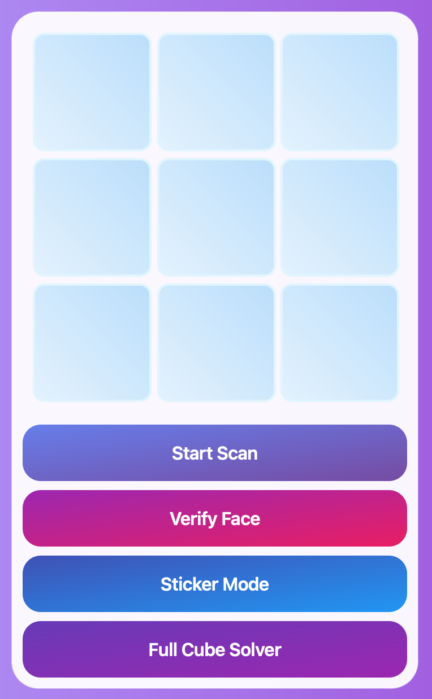
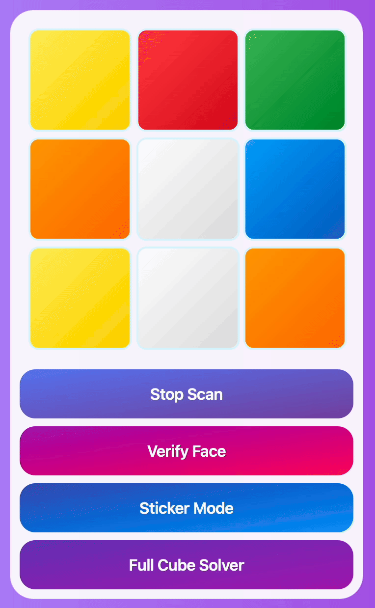

# Rubiks Cube Solver

A modern PyQt6 + OpenCV + PyTorch application for scanning, recognizing, and solving a Rubik’s Cube. This project combines real-time video processing, deep learning color classification, and multiple solving algorithms into a clean GUI experience.

---

## ✨ Features

* **Live Video Capture** with OpenCV.
* **Sticker & Stickerless Modes**:

  * Sticker Mode → Detects cube stickers from the camera.
  * Stickerless Mode → *TBD*
* **Color Prediction** powered by a trained ResNet18 model (PyTorch).
* **Interactive Cube Grid** for manual editing/verification.
* **Step-by-Step Solvers**:

  * Cross Solver
  * Corner Solver
  * Second Layer Edge Solver
  * Last Layer Yellow Cross Solver
  * OLL Solver
  * PLL Solver
  * Full Cube Solver
* **Modern UI** built with PyQt6:

  * Gradient buttons
  * Hover effects
  * Frameless window with polished styling

---

## 🚀 Getting Started

### 1. Clone the Repository

```bash
git clone https://github.com/VinnyT456/Rubiks-Cube-Solver.git
cd Rubiks-Cube-Solver
```

### 2. Install Dependencies

Make sure you’re using **Python 3.9+**.

```bash
pip install -r requirements.txt
```

### 3. Model File

Place the trained PyTorch model file `best_model.pth` in the project root.

---

## 🖥️ Usage
 
**1.** Run the GUI/Scanner
```
python scan.py
```

**2.** Place the green face of the cube towards the camera.

**3.** Slowly rotate the cube upward and downward to capture the white and yellow sides first.

**4.** Change the colors if scanned wrong and press verify after each scan.

**5.** Then rotate and capture the remaining sides one by one.

**6.** Once all six faces are scanned, the solver will generate a step-by-step solution.

### Controls

* **Start Scan** → Begin color prediction from camera feed.
* **Verify Face** → Lock in the current scanned face.
* **Sticker Mode / Stickerless Mode** → Toggle between automatic detection and manual grid.
* **Full Cube Solver** → Cycle through available solving strategies.

---

## 📂 Project Structure

```
Rubik's Cube Solver
 ┣ scan.py          # Entry point (CubeScanner + GUI)
 ┣ solver.py        # Cube solving algorithms
 ┣ best_model.pth   # Trained PyTorch color classification model
 ┣ requirements.txt # Python dependencies
 ┗ README.md        # Project documentation
```

---

# 📸 Screenshot



# 🎥 Demo


---

## 🧠 Model Training

* Uses **ResNet18** (transfer learning) for color classification.
* Trained to classify 6 cube face colors: `Blue, Green, Orange, Red, White, Yellow`.
* Input images are preprocessed with torchvision transforms.

---

## 🎨 UI Showcase

* **Video Panel** → Displays live camera feed with overlays.
* **Cube Grid** → Interactive 3×3 widget for each face.
* **Controls Panel** → Gradient-styled buttons for scanning, verifying, and solving.

---

## 🛠️ Future Improvements

* Expand solver efficiency and performance.
* Improve **color calibration** for different lighting.
* Export cube states & solutions as text or JSON.
* Add keyboard shortcuts for faster navigation.

---

## 🤝 Contributing

Pull requests are welcome! If you’d like to improve the UI, solver efficiency, or add features, feel free to fork and submit.

---

## 📜 License

MIT License. Free to use and modify.

---

## 🌟 Acknowledgements

* OpenCV for real-time vision
* PyTorch for deep learning
* PyQt6 for the GUI framework
* Claude for the design
